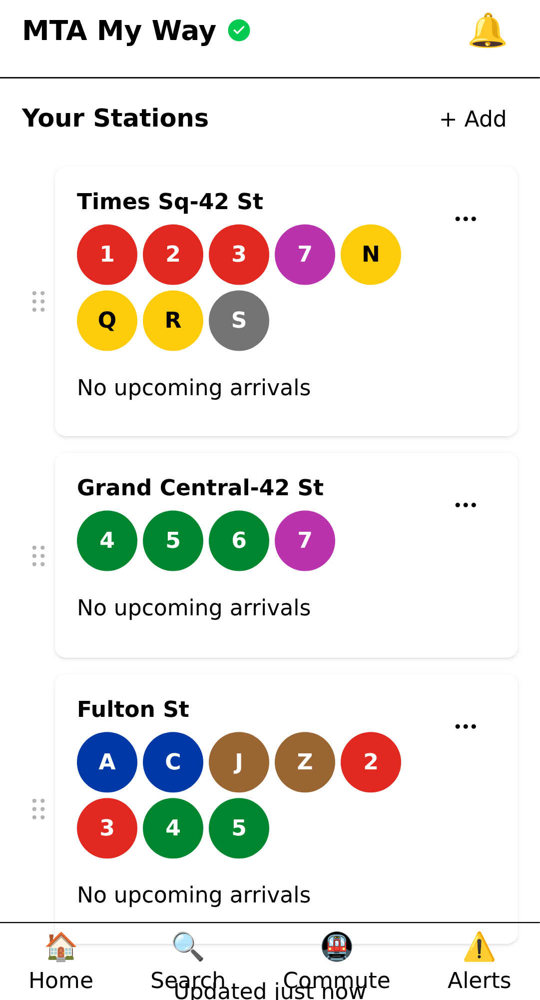
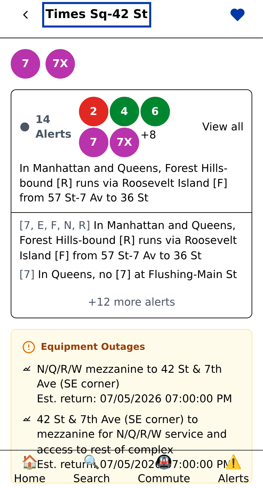
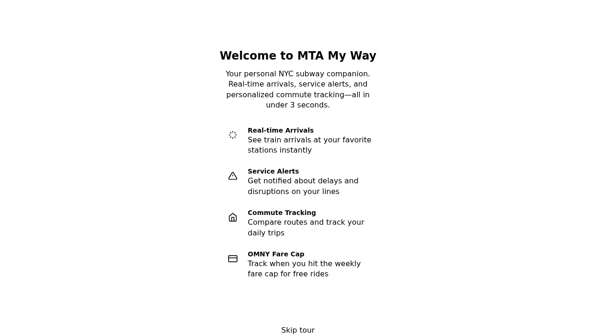

# MTA My Way

A mobile-first Progressive Web App (PWA) for daily NYC subway commuters. Design philosophy: **open and see your data in under three seconds** — your pinned stations front and center, no map to dismiss, no search to type.

Version 0.0.1

## Preview








## Features

1. **Favorites-first home screen** — pinned stations with inline live arrival countdowns; GPS-powered 60-second onboarding for first-time users
2. **Real-time arrivals** — live countdowns per station, both directions; pull-to-refresh; 30s auto-refresh; offline fallback via PWA cache
3. **Transfer intelligence** — commute analyzer shows whether you should transfer using real-time train positions: RECOMMENDED / DIRECT / ALSO POSSIBLE, with walk-time comparison
4. **Predictive delay detection** — tracks vehicle positions across consecutive 30s polls; when a train's inter-station time exceeds 2× the scheduled baseline, generates early-warning synthetic alerts before MTA publishes them
5. **Smart alerts** — filtered to your exact stations, lines, and directions; plain-language rewrites of raw MTA alert text; push notifications via WebPush/VAPID
6. **Context-aware switching** — detects home/commute/transfer context from location, time patterns, and tap history; frequency-sorts favorites during commute hours
7. **Interactive transit map** — SVG map with pan/zoom, real-time pulsing train positions, line filtering, and tap-to-detail modal
8. **Trip journal** — automatic trip tracking with full history and statistics (average, median, std dev, trends)
9. **Subway Year** — shareable annual summary card (Spotify Wrapped-style), exportable as PNG; configurable time window
10. **Fare tracking** — OMNY fare cap progress and weekly spending
11. **Elevator/escalator status** — equipment status per station from the MTA ENE feed
12. **Health dashboard** — `/status` HTML page and `/api/health` JSON endpoint with per-feed circuit-breaker state

## Transit Data

All real-time data is from the [MTA GTFS-RT Protobuf API](https://api.mta.info/). An API key is optional but recommended to avoid rate limiting — register free at https://api.mta.info/

| Feed | Lines |
|------|-------|
| gtfs | 1 2 3 4 5 6 7 S GS |
| gtfs-ace | A C E H FS |
| gtfs-bdfm | B D F M |
| gtfs-g | G |
| gtfs-jz | J Z |
| gtfs-l | L |
| gtfs-nqrw | N Q R W |
| gtfs-si | SIR (Staten Island Railway) |

Polling intervals: 30s (arrivals), 60s (alerts), 300s (equipment). Static schedule from MTA's published GTFS ZIP.

## Quick Start

**Prerequisites:** Node.js ≥ 22, npm ≥ 10

```bash
git clone https://github.com/jedarden/mta-my-way.git
cd mta-my-way
npm install

# One-time: process GTFS static schedule data
npm run process-gtfs --workspace=packages/server

# Start development server
npm run dev --workspace=packages/server
```

App available at `http://localhost:3001`. Set `MTA_API_KEY` in your environment to avoid MTA rate limits during development.

## Docker

```bash
docker build -t mta-my-way .
docker run \
  -e ALLOWED_HOSTS=your.domain.com \
  -e MTA_API_KEY=your_key_here \
  -p 3000:3000 \
  mta-my-way
```

The container exposes port 3000.

## Environment Variables

| Variable | Required | Default | Notes |
|----------|----------|---------|-------|
| `PORT` | No | `3000` | HTTP listen port |
| `NODE_ENV` | No | — | `production` or `development` |
| `ALLOWED_HOSTS` | Yes (prod) | — | Comma-separated hostnames; server refuses to start without this in production |
| `MTA_API_KEY` | Recommended | — | MTA GTFS-RT API key; works without but may be rate-limited. Register at https://api.mta.info/ |
| `VAPID_PUBLIC_KEY` | For push | — | Generate: `npx web-push generate-vapid-keys` |
| `VAPID_PRIVATE_KEY` | For push | — | Never commit to version control |
| `VAPID_SUBJECT` | For push | `mailto:mta-my-way@example.com` | Contact URI included in push requests |
| `PASSWORD_PEPPER` | Recommended | — | `openssl rand -hex 32` |
| `EMAIL_PROVIDER` | No | `console` | `ses`, `smtp`, `sendgrid`, or `console` |
| `EMAIL_FROM` | No | `noreply@mtamyway.com` | Sender address for transactional email |
| `LOG_LEVEL` | No | `info` | `debug`, `info`, `warn`, `error` |
| `BASE_URL` | No | `http://localhost:3001` | Base URL for OAuth callbacks |
| `GOOGLE_OAUTH_CLIENT_ID` | For Google OAuth | — | From Google Cloud Console |
| `GOOGLE_OAUTH_CLIENT_SECRET` | For Google OAuth | — | From Google Cloud Console |
| `GITHUB_OAUTH_CLIENT_ID` | For GitHub OAuth | — | From GitHub developer settings |
| `GITHUB_OAUTH_CLIENT_SECRET` | For GitHub OAuth | — | From GitHub developer settings |

## OAuth 2.0 Authentication

This application supports OAuth 2.0 authentication with both **Google** and **GitHub** providers using the **Authorization Code flow with PKCE** (Proof Key for Code Exchange, RFC 7636).

### How PKCE Works

1. **Authorization Request**: The server generates a random `code_verifier` (32 bytes) and creates a `code_challenge` by hashing it with SHA-256 and base64url-encoding. The challenge (not the verifier) is sent to the OAuth provider along with the authorization request.
2. **User Authorization**: User is redirected to the provider (Google/GitHub) to grant permissions.
3. **Code Exchange**: Provider redirects back with a temporary `code`. The server exchanges this code for an access token by sending the original `code_verifier`.
4. **Token Validation**: Provider verifies the `code_verifier` matches the `code_challenge` from step 1, preventing authorization code interception attacks.

**Security**: The PKCE verifier never leaves the server. Only a single-use `state` parameter is sent to the browser, making the flow secure without requiring a client secret.

### Callback URL Configuration

OAuth providers require pre-registered callback URLs. The application constructs these using the `BASE_URL` environment variable:

| Provider | Default Callback URL | Environment Variable Override |
|----------|---------------------|-------------------------------|
| Google | `{BASE_URL}/auth/google/callback` | `GOOGLE_OAUTH_REDIRECT_URI` |
| GitHub | `{BASE_URL}/auth/github/callback` | `GITHUB_OAUTH_REDIRECT_URI` |

**Example**: If `BASE_URL=https://mtamyway.com`, the Google callback URL will be `https://mtamyway.com/auth/google/callback`.

### Setup Instructions

#### Google OAuth

1. Go to [Google Cloud Console](https://console.cloud.google.com/apis/credentials)
2. Create a new project or select an existing one
3. Navigate to **APIs & Services** → **Credentials**
4. Click **Create Credentials** → **OAuth 2.0 Client ID**
5. Choose **Web application**
6. Add these **Authorized redirect URIs**:
   - Development: `http://localhost:3001/auth/google/callback`
   - Production: `https://your-domain.com/auth/google/callback`
7. Copy the **Client ID** and **Client Secret** to your `.env` file:
   ```bash
   GOOGLE_OAUTH_CLIENT_ID=your-google-client-id.apps.googleusercontent.com
   GOOGLE_OAUTH_CLIENT_SECRET=your-google-client-secret
   ```

#### GitHub OAuth

1. Go to [GitHub Developer Settings](https://github.com/settings/developers)
2. Click **OAuth Apps** → **New OAuth App**
3. Fill in the application details:
   - **Application name**: MTA My Way
   - **Homepage URL**: `https://your-domain.com` (or `http://localhost:3001` for development)
   - **Authorization callback URL**: `{BASE_URL}/auth/github/callback`
     - Development: `http://localhost:3001/auth/github/callback`
     - Production: `https://your-domain.com/auth/github/callback`
4. Click **Register application**
5. Copy the **Client ID** and generate a **Client Secret** to your `.env` file:
   ```bash
   GITHUB_OAUTH_CLIENT_ID=your-github-client-id
   GITHUB_OAUTH_CLIENT_SECRET=your-github-client-secret
   ```

### Open Redirect Protection

The application includes strict security controls to prevent open redirect attacks during OAuth flows:

- **OAUTH_ALLOWED_HOSTNAMES**: A hardcoded allowlist of permitted callback hostnames
  - `localhost`, `127.0.0.1` (for local development)
  - `mtamyway.com`, `www.mtamyway.com` (for production)
- **Validation**: All redirect URLs are validated against this allowlist before use
- **Blocking**: Suspicious TLDs, external redirects, and URL encoding attacks are blocked

**To add additional hostnames**: Edit `packages/server/src/middleware/open-redirect.ts` and add your domain to the `OAUTH_ALLOWED_HOSTNAMES` array.

### Local Development

For local OAuth testing:

1. Set up your provider credentials with the local callback URL:
   - Google: `http://localhost:3001/auth/google/callback`
   - GitHub: `http://localhost:3001/auth/github/callback`
2. Configure environment variables:
   ```bash
   BASE_URL=http://localhost:3001
   GOOGLE_OAUTH_CLIENT_ID=your-dev-client-id
   GOOGLE_OAUTH_CLIENT_SECRET=your-dev-client-secret
   GITHUB_OAUTH_CLIENT_ID=your-dev-client-id
   GITHUB_OAUTH_CLIENT_SECRET=your-dev-client-secret
   ```
3. Start the development server and test OAuth flow

### Production Deployment

For production:

1. Set `BASE_URL` to your production domain:
   ```bash
   BASE_URL=https://your-domain.com
   ```
2. Update OAuth provider callback URLs in your provider consoles to match production
3. Ensure `ALLOWED_HOSTS` is set for host header protection (required in production)
4. Verify your domain is added to `OAUTH_ALLOWED_HOSTNAMES` in the code
5. Store credentials securely (use environment variables, never commit to git)

### Security Notes

- **Credentials**: Never commit OAuth client secrets to version control
- **HTTPS**: OAuth requires HTTPS in production (providers reject non-HTTPS callbacks)
- **State Verification**: The server generates and validates state parameters to prevent CSRF attacks
- **PKCE Required**: The application only supports PKCE flow (RFC 7636) for security
- **Session Management**: OAuth credentials are never stored; only a session cookie is issued
- **Single-Use State**: OAuth state values are one-time and expire after 10 minutes

## Development Commands

```bash
npm test                        # all unit/integration tests (Vitest)
npm run test:watch              # watch mode
cd tests/e2e && npm test        # Playwright E2E tests
npm run lint                    # Biome + ESLint
npm run format                  # Biome format --write
npm run typecheck               # tsc --build
```

**Code style:** Biome for formatting, TypeScript strict mode throughout. Commit prefix convention: `feat:`, `fix:`, `docs:`, `refactor:`, `test:`.

## API Reference

| Method | Path | Description |
|--------|------|-------------|
| GET | `/status` | Health dashboard (HTML) |
| GET | `/api/health` | Per-feed status and circuit-breaker state (JSON) |
| GET | `/api/metrics` | Prometheus metrics |
| GET | `/api/arrivals/:stationId` | Real-time arrivals for a station |
| GET | `/api/stations` | Full GTFS station list |
| GET | `/api/stations/search` | Type-ahead search by name, line, or cross-street |
| GET | `/api/routes` | Route index |
| POST | `/api/commute/analyze` | Analyze routes between origin and destination |
| GET | `/api/alerts` | All current MTA alerts |
| GET | `/api/alerts/:lineId` | Alerts filtered by line |
| GET | `/api/push/vapid-public-key` | VAPID public key for push registration |
| POST | `/api/push/subscribe` | Register device for push notifications |
| GET | `/api/trip/:tripId` | Live trip progress (stop-by-stop) |

## Observability

OpenTelemetry (OTLP gRPC), Prometheus `/api/metrics`, Pino structured JSON logging. See [docs/observability.md](docs/observability.md) for configuration details.

## Project Structure

```
mta-my-way/
├── packages/
│   ├── shared/           # TypeScript types and constants (feed config, polling intervals)
│   ├── server/
│   │   ├── src/          # Hono app, pollers, GTFS parsers, push engine, context engine
│   │   ├── data/         # Generated GTFS JSON + SQLite (subscriptions, trips, sessions)
│   │   └── scripts/      # process-gtfs.mjs
│   └── web/
│       └── src/
│           ├── screens/  # Home, Station, Map, Commute, Alerts, Journal, Stats, ...
│           ├── components/
│           ├── hooks/
│           └── stores/   # Zustand (favorites, journal, settings, fare)
├── tests/
│   └── e2e/              # Playwright tests
├── docs/
│   ├── plan/plan.md      # Architecture and roadmap
│   ├── testing.md
│   ├── security.md
│   └── observability.md
└── Dockerfile            # Multi-stage: build-web → build-server → runtime
```

## Documentation

- [Testing Guide](docs/testing.md)
- [Security](docs/security.md)
- [Observability](docs/observability.md)
- [Architecture Plan](docs/plan/plan.md)

## License

MIT
